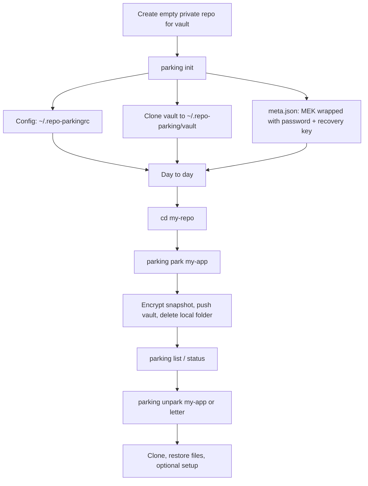

# repo-parking — how it works and code review

This document explains the product in plain language and records a full codebase review (bugs, fixes, and ideas).

---

## 1. What this tool does (one paragraph)

**repo-parking** helps you free disk space when you are not actively working on a git project. You run it from your repo: it encrypts secrets (`.env`, optional extra files, optional SSH passphrase), stores a small JSON record plus encrypted blobs in a **private git repo you own** (the “vault”), pushes that vault to GitHub/GitLab, then **deletes your local project folder**. Later, on this machine or another, you run **unpark**: it clones from the original remote, restores `.env` and extra files, optionally runs your setup command, and you keep working. Your code always lives on the normal remote; the vault only holds metadata and encrypted sidecar data.

---

## 2. Simple flow (first-time user)




---

## 3. Where things live on disk


| Location                   | Purpose                                                                                |
| -------------------------- | -------------------------------------------------------------------------------------- |
| `~/.repo-parkingrc`        | JSON config: `vaultRemote`, `vaultPath`, `vaultBranch`                                 |
| `~/.repo-parking/vault/`   | Local clone of the vault git repo                                                      |
| `vault/meta.json`          | `retiredIds`, wrapped MEK (password + recovery), HMAC **verifier**                     |
| `vault/projects/{ID}.json` | One parked project: name, remotes, branch, encrypted env/extra files, setup cmd, notes |


**Letters (A, B, C…)** are stable IDs. “Forget” retires a letter forever so old notes and docs never point at the wrong project.

---

## 4. Program structure (files)


| Path             | Role                                                                                                          |
| ---------------- | ------------------------------------------------------------------------------------------------------------- |
| `bin/parking.js` | CLI entry: Node 18 check, Commander routes, `exitOverride` so vault rollback can run                          |
| `lib/config.js`  | Read/write `~/.repo-parkingrc`                                                                                |
| `lib/vault.js`   | Clone/pull vault, read/write `meta.json` and `projects/*.json`, `pushVault` with rollback on failed push      |
| `lib/git.js`     | Repo detection, upstream/remotes, uncommitted/unpushed checks, commit/push/clone helpers                      |
| `lib/crypto.js`  | AES-256-GCM, PBKDF2 password wrap, MEK, recovery key, HMAC verifier                                           |
| `lib/files.js`   | Safe paths (no `..`), base64 file encode/decode, gitignore-based extra file discovery, letter IDs             |
| `lib/env.js`     | Read/write `.env` bytes                                                                                       |
| `lib/ssh.js`     | Parse `~/.ssh/config`, `ssh-add` with optional askpass temp script                                            |
| `lib/spinner.js` | Terminal spinner                                                                                              |
| `commands/*.js`  | One module per subcommand: `init`, `park`, `unpark`, `list`, `status`, `forget`, `change-password`, `recover` |


**Dependencies:** `commander`, `inquirer`, `simple-git`.

---

## 5. Encryption model (short)

1. **MEK** — random 32-byte key; encrypts project payloads (env, extra files, SSH passphrase).
2. **Master password** — never stored; unwraps MEK via PBKDF2 + AES-GCM (`wrapMEK` / `unwrapMEK`).
3. **Recovery key** — also wraps MEK; shown once at init; allows password reset via `parking recover`.
4. **Verifier** — HMAC-SHA256 over a fixed string; confirms the correct MEK after unwrap without decrypting project fields.

Legacy vaults used the password directly on each blob; newer vaults use MEK + verifier (see `unpark.js` branch on `meta.mek_wrapped_password`).

---

## 6. Code review summary

**Scope:** Full static review of the repository. You are on branch `main` with no local diff vs `origin/main` in this workspace; review is whole-codebase, not PR-scoped.

**CodeRabbit:** The CodeRabbit CLI is not installed in this environment. To run it locally:

```bash
curl -fsSL https://cli.coderabbit.ai/install.sh | sh
coderabbit auth login
coderabbit review --agent -t all
```

---

### 6.1 Critical issues found and fixed in this session


| Issue                                                                                                                                                 | Impact                                                                                                 | Change                                                                                            |
| ----------------------------------------------------------------------------------------------------------------------------------------------------- | ------------------------------------------------------------------------------------------------------ | ------------------------------------------------------------------------------------------------- |
| `lib/git.js`: `isGitRepo`, `hasCommits`, `getUncommittedFiles`, `getUnpushedCommits`, `commitAndPush`, `pushOnly` used **simple-git without `await`** | Repo checks could always pass; uncommitted/unpushed detection and auto-commit/push could silently fail | Made these functions **async**, used `await` on git calls; `**commands/park.js`** now awaits them |
| `commands/park.js` (multi-remote path): `remoteGetUrl` / `config` used without await                                                                  | Could throw or produce wrong URL                                                                       | Replaced with `**await git.raw([...])`**                                                          |
| `commands/unpark.js`: push URL restore called `**remoteSetUrl` without await** (and odd argument shape)                                               | Race: later steps might run before remote URL updated                                                  | `**await git.raw(['remote','set-url','--push','origin', url])`**                                  |
| ANSI reset sequences in `init` / `change-password` / `recover` used `**\x1b[0`** instead of `**\x1b[0m**`                                             | Minor terminal formatting glitches                                                                     | Normalized to `**\x1b[0m**`                                                                       |


---

### 6.2 Remaining findings (not auto-fixed)


| Severity             | Topic                                                                                                                                           | Detail                                                                    |
| -------------------- | ----------------------------------------------------------------------------------------------------------------------------------------------- | ------------------------------------------------------------------------- |
| **P1 — product gap** | `change-password.js` tells users to run `**parking migrate`** for legacy vaults, but **no `migrate` command** is registered in `bin/parking.js` | Either implement `migrate` or change the message to a supported path      |
| **P2**               | `package.json` uses `**"commander": "latest"`** and `**"simple-git": "latest"`**                                                                | Non-reproducible installs; pin semver ranges for releases                 |
| **P2**               | `lib/ssh.js` `**addSshKey`** registers `process.on('exit'/'SIGINT'/'SIGTERM')` on every call                                                    | Repeated unparks can stack listeners; consider `once` or explicit cleanup |
| **P2**               | `lib/vault.js` `**pushVault`** outer `catch` returns `false` without surfacing `err.message`                                                    | Harder to debug failed pushes                                             |
| **P3**               | `lib/config.js` `**loadConfig`**: corrupt JSON returns `null` same as missing file                                                              | Could log or distinguish “missing” vs “invalid” for support               |
| **P3**               | `**getUnpushedCommits`** when there is no upstream falls back to **full `git log`** in some error paths                                         | Large repos could be slow (pre-existing behavior; worth tightening)       |


---

### 6.3 Security and trust notes (informational)

- **Vault repo** must stay private; anyone with read access sees ciphertext and metadata (names, remotes, branch).
- **Setup command** runs with `shell: true` on unpark after user confirmation — same trust model as running a script yourself.
- **SSH passphrase** can be stored encrypted in the vault; MEK compromise would expose it.

---

## 7. Ideas related to this product only

1. `**parking migrate`** — real command to re-wrap legacy per-field encryption to MEK format (matches today’s messaging).
2. **Dry-run / `parking park --plan`** — show what would be encrypted and pushed without deleting the folder.
3. **Size / quota warning** — total vault size or per-project payload size before push.
4. **Tests** — unit tests for `lib/crypto.js`, `lib/files.js` path validation, and mocked `simple-git` for `lib/git.js` (high value after the async fixes).
5. `**npm shrinkwrap` or lockfile discipline** — `package-lock.json` is present; drop `"latest"` deps for repeatable CI.
6. **Windows** — README says macOS/Linux only; if you ever support Windows, revisit `lib/ssh.js` askpass and paths.

---

## 8. How to read the code (suggested order)

1. `README.md` — user-facing behavior
2. `bin/parking.js` — command wiring
3. `commands/init.js` — vault bootstrap
4. `commands/park.js` — main complexity (safety checks, encrypt, delete)
5. `commands/unpark.js` — restore path
6. `lib/vault.js` + `lib/crypto.js` — persistence and crypto

---

*Generated as part of a full-project walkthrough and review. Update this file when architecture or commands change.*